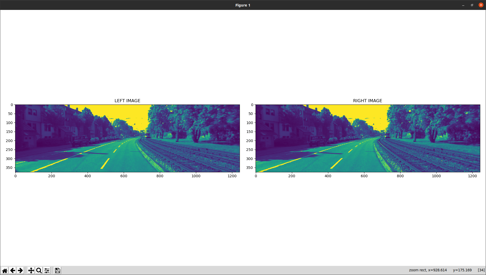
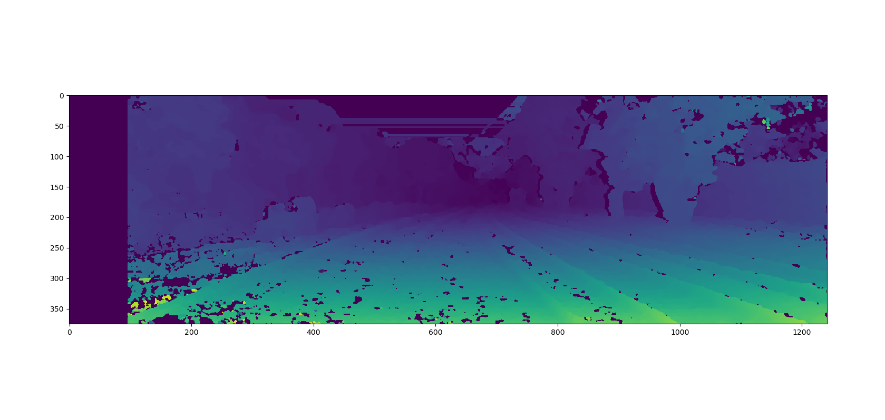
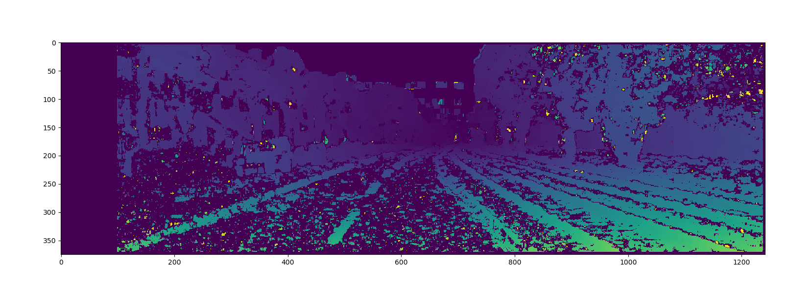
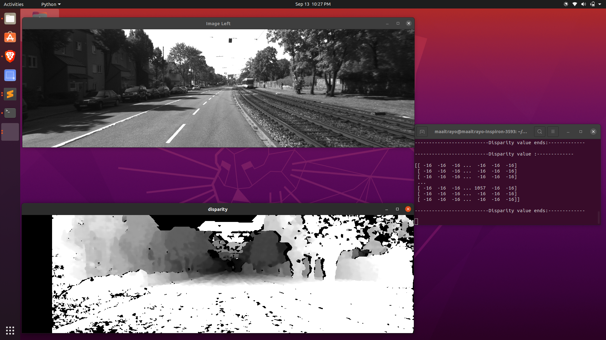
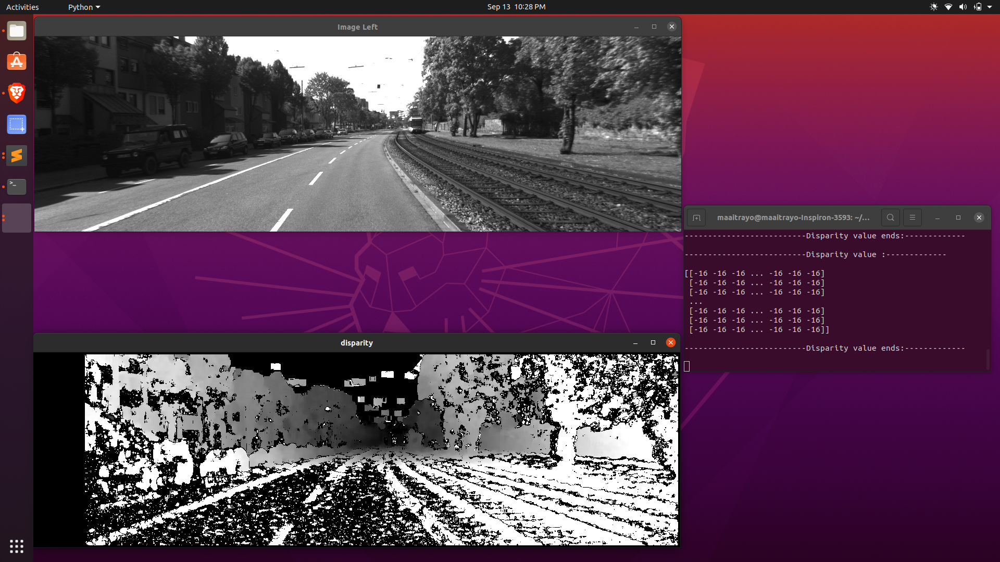

# Disparity-from-stereo-images

Calculating the disparity from a pair of stereo image

## Left and right images:

## Output for Disparity type SBGM:

## Output for Disparity type BM:

## Entire process for SBGM:

## Entire process for BM:

